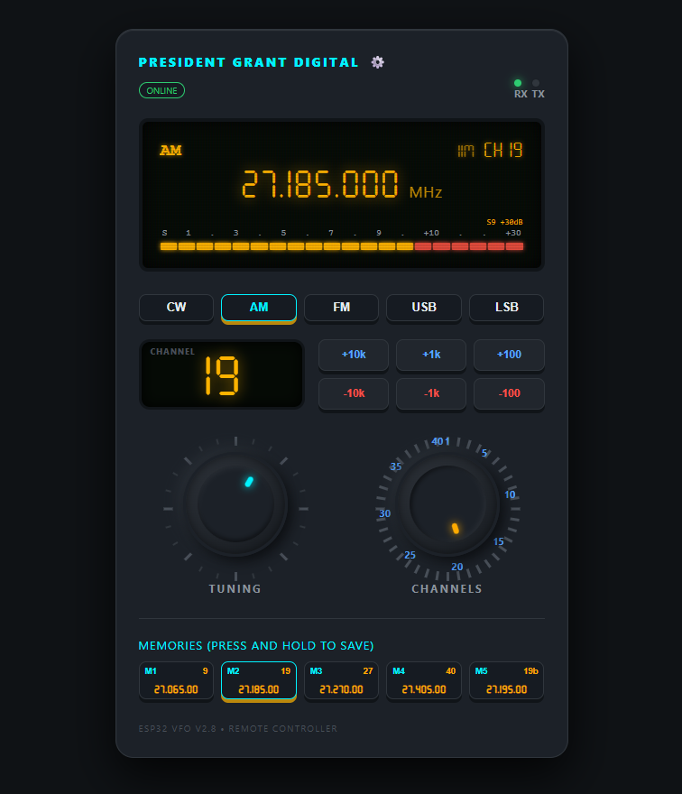
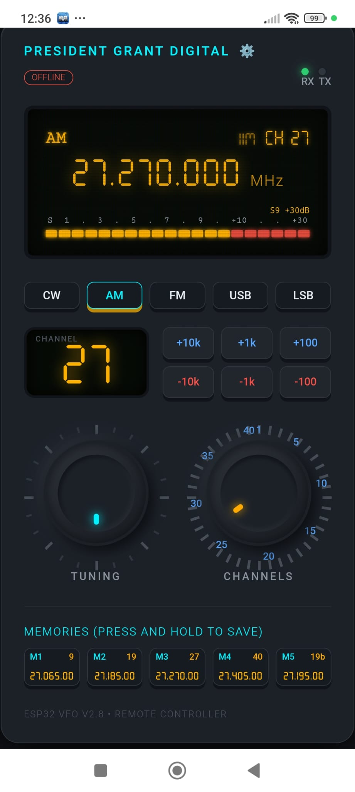
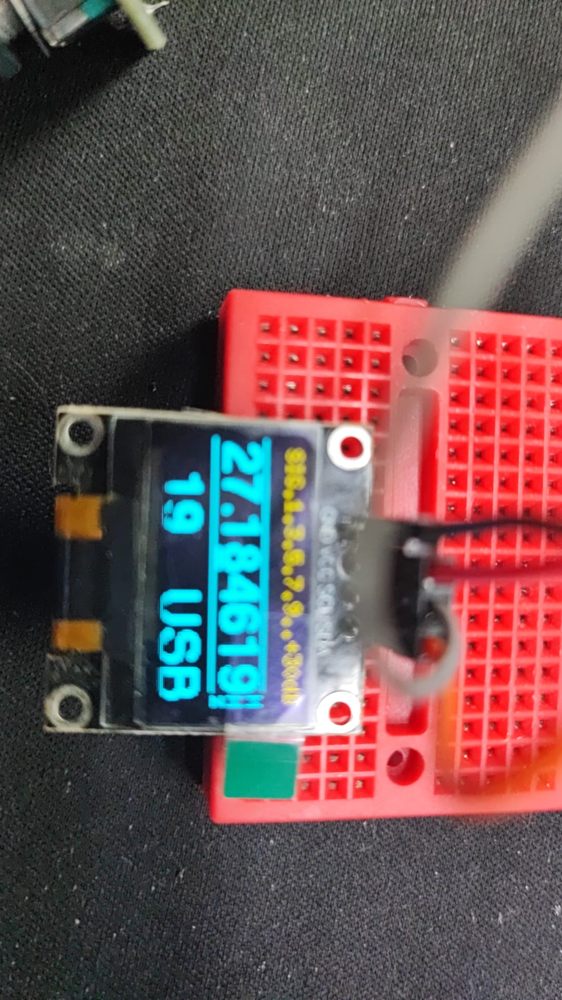
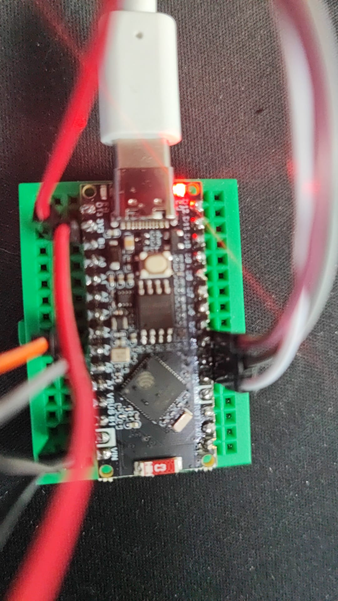
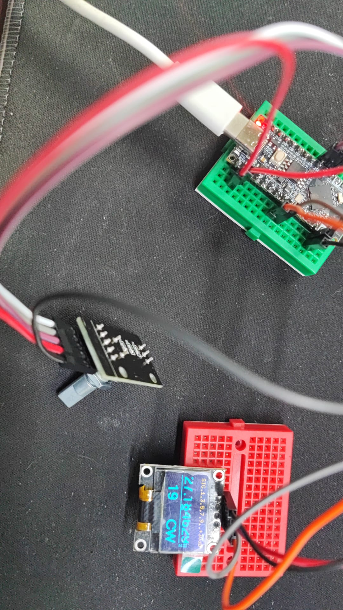
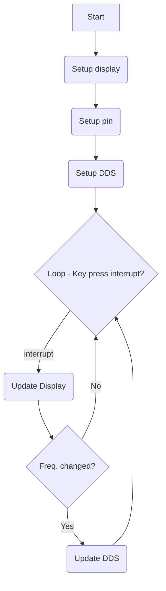

# Arduino Cibi VFO (ESP32 Port)

This project is an adaptation for the **Arduino Nano ESP32** of the original digital VFO by Vincent Hervieux. It is designed to modernize classic CB (Citizen Band) transceivers (such as the President Grant, Superstar 360 FM/3900, etc.) by replacing analog oscillators and channel selectors with high-precision digital synthesis.

## 🚀 Features

- **ESP32 Core**: Ported to Arduino Nano ESP32 for increased power and memory.
- **Si5351 Frequency Synthesis**: Perfect digital stability, replacing old crystals and PLL circuits.
- **OLED Display (128x64)**: Real-time display of frequency, channel, band, modulation mode, and digital S-meter.
- **Multi-mode Support**: Automatic handling of Intermediate Frequencies (IF) for AM, FM, USB, LSB, and CW.
- **Remote Control & Monitoring**: 
  - **Full Mode Selection**: Change radio modes (CW, AM, FM, USB, LSB) directly from the web interface.
  - **Intelligent Override**: Digital commands are respected unless the physical radio switch is moved, which then regains priority.
  - **Real-time Status**: Live monitoring of RX/TX state and connection health (Online/Offline) via a modernized web header.
  - **Throttled Tuning**: High-speed virtual knob support with 50ms request throttling to prevent server saturation.
- **WiFiManager Integration**: No more hardcoded credentials. Easy WiFi setup via a captive portal (`CIBI-VFO-ESP32-AP`).
- **ESP32 Optimized**: 
  - **Single-Cycle Refresh**: Zoned OLED update logic (top/middle/bottom) reducing I2C traffic by up to 75% for S-meter updates.
  - **Signal Filtering**: Exponential Moving Average (EMA) filtering on S-meter and Clarifier for smooth, jitter-free "analog" feel.
  - **12-bit Precision**: Native ESP32 ADC resolution (0-4095) for high-sensitivity signal and tuning measurement.
  - **Asynchronous WiFi**: Non-blocking network stack ensuring VFO responsiveness even during connection attempts or portal configuration.
  - **Hardware Stability**: Internal pull-down resistors enabled for all modulation inputs to prevent floating state interference.
  - **Watchdog**: ESP32 Task Watchdog Timer (TWDT) for maximum system reliability.
- **Digital Clarifier**: Fine-tune reception via a potentiometer with software-based center calibration.
- **Band Scan**: Automatic frequency scanning functionality.
- **Non-Volatile Memory**: Automatic saving of the last frequency and settings in the (emulated) EEPROM.
- **Configuration Menu**: Adjust IF offsets, band limits, calibrate the Si5351, and set Clarifier ADC center directly using the encoder.

## 🌐 Advanced Web Interface (v2.9)

The project includes a powerful, responsive web interface for remote control and advanced configuration:
- **Web Interface**:
  - 
- **Mobile Web Interface**:
  - 
- **Professional Display**: Realistic **'Seven Segment'** digital font for high-precision frequency and channel indicators.
- **Dedicated Channel LCD**: Large integrated LCD-style display specifically for CB channel visualization (with Alpha/Bis support).
- **Advanced Memory Buttons**: 
    - Real-time display of stored Label, Channel, and Formatted Frequency.
    - Active selection indicator with theme-aware glow.
    - Visual feedback (progress bar) when holding to save.
- **Real-time Status**: 200ms polling interval for stability, using optimized JSON memory management.
- **Dual Virtual Knobs**: 
    - **Tuning Knob (Blue)**: High-resolution fine tuning (100 Hz steps).
    - **Channel Knob (Orange)**: Standard CB channel switching (10 kHz steps) with 1-40 indexed ticks.
- **Responsive Design**: Optimized for both Desktop and Mobile devices.
- **Interactive S-Meter & Waterfall**: Real-time signal strength visualization and spectrum history.
- **Web-based Advanced Settings (⚙️)**:
    - **Calibration**: Real-time VFO/Si5351 correction adjustment.
    - **Clarifier Center**: Calibrate your physical potentiometer's center point.
    - **IF Offsets**: Configure AM, USB, and LSB intermediate frequencies.
  - **Frequency Limits**: Set custom Min/Max frequency range.
  - **S-Meter Calibration**: Adjust S-Meter sensitivity via software.
  - **Step Increment**: Configure default frequency steps.
- **Customization**: 5 distinct color themes (Classic Green, Vintage Amber, Deep Blue, Arctic White, Emergency Red).
- **Memory Management**: 5 memory slots with quick load, long-press save, and a global "Reset Memories" function.
- **Network Stability**: Built-in request throttling and error handling to ensure ESP32 stability under high usage.

## 🛠 Hardware Parts
- **Board**: Arduino Nano ESP32.
- **Clock Generator**: [Si5351A](doc/Si5351-B.pdf) module (3 outputs).
- **Display**: OLED SSD1306 128x64 IIC.
- **Inputs**: 
  - Rotary encoder with push button.
  - Modulation selector (wired for mode detection).
  - Potentiometers for Clarifier and S-Meter.

## 📐 Principles

### Basic Principles
A rotary encoder with a button is used:
- Turning the encoder adjusts the frequency.
- Clicking the encoder button changes the frequency step or enters digit selection mode.

### Advanced Explanations
- **Web Server**: The ESP32 hosts a web server providing a JSON API (`/status`) and control endpoints (`/set`, `/updateconfig`, `/resetmem`).
- **Modulation**: Read from the radio's selector and wired to D8-D12 to adjust VFO and IF (especially for USB/LSB +/- 2.5kHz shifts).
- **TX**: Read from the mic plug (D5) to activate the IF oscillator during transmission only.
- **S-meter**: Implemented via analog input A3.
- **Scan Mode**: Activated in "increment" mode (CH9 switch). When a signal is found (S-meter > threshold), the scan stops.

## 💻 Installation (Arduino IDE)

1.  Download the `arduino-cibi-vfo-esp32` folder.
2.  Open `arduino-cibi-vfo-esp32.ino` in the Arduino IDE.
3.  Install the required libraries via the Library Manager:
    - **U8g2** (by olikraus) - For the OLED display.
    - **WiFiManager** (by tzapu) - For dynamic WiFi configuration.
    - **Ticker** (Built-in for ESP32) - For encoder servicing.
4.  In **Tools > Board**, select **Arduino Nano ESP32**.
5.  Verify and Upload the code.

*Note: `ClickEncoder` and `Si5351mcu` libraries are included locally in the project folder to ensure compatibility.*

## 🔌 Wiring
Referring to `vfo.h` and `input.cpp`:
- **D12** = INPUT CW +3.3v
- **D11** = INPUT AM +3.3v
- **D10** = INPUT FM +3.3v
- **D9** = INPUT USB +3.3v
- **D8** = INPUT LSB +3.3v
- **D6** = CONFIG MENU (active low) - masse
- **D5** = TX (active low) - masse
- **D4** = Button pin (active low) - masse
- **D3** = Rotary encoder A
- **D2** = Rotary encoder B
- **A1** = Step/increment mode (active low) - masse
- **A2** = Clarifier input (analog)
- **A3** = S-meter input (analog)
- **A4** = I2C SDA
- **A5** = I2C SCL

**DDS Output (Si5351):**
- **CLK0** = IF (10.695MHz +/- 2.5kHz)
- **CLK2** = VFO (variable)

## ⚖️ License & Copyright

/*
 * Copyright (c) 2026, Patrick Ancher zeltron2k3@gmail.com
 * https://github.com/ZelTroN-2k3/arduino-cibi-vfo-esp32
 * 
 * Version 2.2.0 (Firmware) / v2.9 (Web Interface)
 * 
 * All rights reserved.
 */

---
GitHub Repository: [https://github.com/ZelTroN-2k3/arduino-cibi-vfo-esp32](https://github.com/ZelTroN-2k3/arduino-cibi-vfo-esp32)
